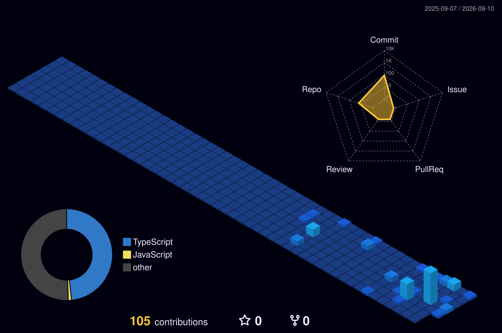

 

# 👋 Hi, I'm Nehal Agrawal

### Full-Stack Developer • AI Engineer • Problem Solver

 

---

## 👨‍💻 About Me

I'm **Nehal Agrawal**, a developer focused on turning ideas into practical, production-oriented software.

I enjoy building applications that combine **full-stack development, AI, analytics, automation, and real-world problem solving**.

My work spans intelligent product platforms, supply-chain analytics, grocery comparison systems, asset management, and AI-powered applications.

### What I Build

- 🚀 Full-stack web applications
- 🤖 AI-powered products and intelligent workflows
- 📊 Data-driven dashboards and analytics
- 🧠 AI search, recommendations and product intelligence
- 🏗️ Scalable application architecture
- 🧩 DSA and problem-solving solutions
- 🌱 Open-source projects and contributions

---

## 🛠️ Tech Stack

### 💻 Languages

### 🎨 Frontend

### ⚙️ Backend & Database

### 🤖 AI, Tools & Platforms

---

# 🚀 Featured Projects

<table>
<tr>

<td width="50%" valign="top">

### 🧠 InduSense AI

**Industrial Product Intelligence Platform**

AI-powered platform designed to understand, search, compare, validate and reason over industrial product data.

**Highlights**

- 📂 CSV/XLSX catalog ingestion
- 🧠 AI-powered product understanding
- 🔍 Natural-language semantic search
- ♻️ Duplicate detection
- ⚖️ Product comparison
- 💡 AI recommendations
- 📊 Data-quality analytics
- 📤 CSV/XLSX export
- 🤖 AI Copilot experience

**Stack**

`Next.js` `React` `TypeScript` `Tailwind CSS` `Gemini` `Recharts` `Three.js` `Vercel`

</td>

<td width="50%" valign="top">

### 🛒 Grocery IQ Compare

**Smart Grocery Price Comparison**

A platform designed to compare grocery shopping costs across major quick-commerce and grocery platforms.

**Highlights**

- 🛍️ Grocery product comparison
- 💰 Cross-platform price comparison
- 🧺 Cart-level comparison
- 📊 Cost-saving insights
- ⚡ Fast comparison workflow
- 🎯 Real-world shopping decisions

**Platforms**

`Blinkit` `Zepto` `Instamart` `BigBasket`

</td>

</tr>

<tr>

<td width="50%" valign="top">

### 🔐 VeriVault

**Asset Management Platform**

A full-stack web application focused on organizing and managing digital or organizational assets.

**Highlights**

- 📦 Asset management workflow
- 🗂️ Structured asset organization
- 🖥️ Modern web interface
- ⚡ Full-stack architecture
- 🚀 Working deployed prototype

</td>

<td width="50%" valign="top">

### ⛓️ Smart Supply Chain Nexus

**Adaptive Supply Chain Intelligence**

A logistics and analytics platform designed to make supply chains more resilient and adaptive.

**Highlights**

- 📊 Logistics analytics
- 📈 Demand forecasting
- 🌍 Regional demand insights
- 🚨 Stock-shortage detection
- 🔄 Smart rerouting
- 🏪 Nearby shops as micro-warehouses
- 📦 Adaptive fulfillment decisions

**Stack**

`React` `TypeScript` `Tailwind` `Recharts` `Replit` `GitHub`

</td>

</tr>
</table>

---

# 📊 GitHub Analytics

---

# 🧊 3D Contribution Profile

<picture>
  <source
    media="(prefers-color-scheme: dark)"
    srcset="./profile-3d-contrib/profile-night-view.svg"
  />

  <source
    media="(prefers-color-scheme: light)"
    srcset="./profile-3d-contrib/profile-green.svg"
  />

  

</picture>

---

# 🐍 Contribution Snake

<picture>

  <source
    media="(prefers-color-scheme: dark)"
    srcset="https://raw.githubusercontent.com/Nehal390/Nehal390/output/github-contribution-grid-snake-dark.svg"
  />

  <source
    media="(prefers-color-scheme: light)"
    srcset="https://raw.githubusercontent.com/Nehal390/Nehal390/output/github-contribution-grid-snake.svg"
  />

  

</picture>

---

# 🎯 Current Focus

<table align="center">
<tr>

<td align="center" width="25%">

### 🚀

**Product Building**

Turning ideas into usable software

</td>

<td align="center" width="25%">

### 🤖

**AI Engineering**

Building intelligent product experiences

</td>

<td align="center" width="25%">

### 🧠

**DSA**

Strengthening problem-solving skills

</td>

<td align="center" width="25%">

### 🏗️

**System Design**

Learning scalable architectures

</td>

</tr>
</table>

---

# 💡 What I Like Building

`AI Applications`

⬇️

`Full-Stack Products`

⬇️

`Data + Analytics`

⬇️

`Automation`

⬇️

`Real-World Problem Solving`

⬇️

`Production-Ready Experiences`

---

# 🌱 Currently Learning

| 📚 DSA | 🏗️ System Design | 🤖 AI Architecture |
|:---:|:---:|:---:|
| 🌐 Advanced Full-Stack | 🔓 Open Source | ☁️ Scalable Systems |

---

# 📈 Contribution Activity

---

# 🏆 GitHub Achievements

---

# 🤝 Let's Connect

---

### 💭 Building ideas into products, one commit at a time.

 

